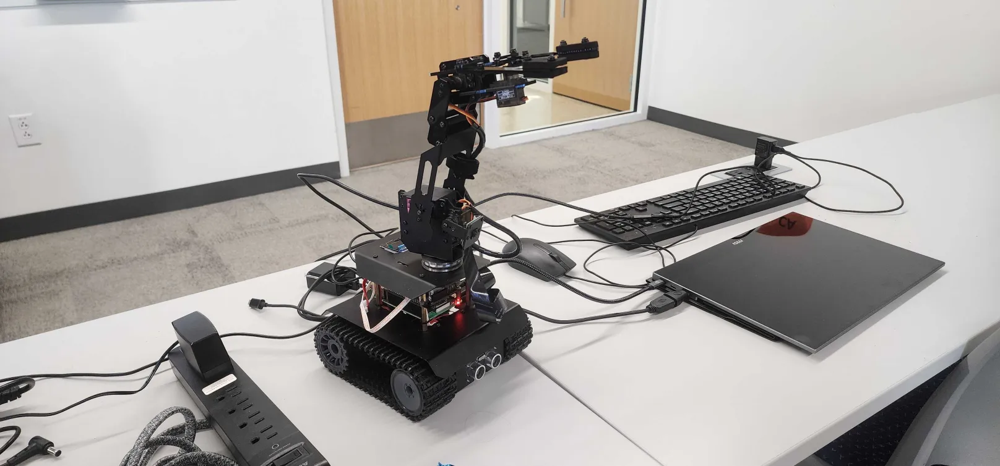

+++
title = "RowdyHacks XI debrief"
date = 2025-11-11
slug = "rh-xi"
[extra]
image=""
+++

At this year's RowdyHacks, our project had a hardware focus.
This was out of my comfort zone; I dislike working with hardware on such short deadlines.
Hardware faults at their best can be as nasty as software faults at their worst.
Luckily, just enough went right this year for our robot to (mostly) function by the end.
Heres a recap of our project, and what I'll be doing different next time around.

# Overview

Our plan was to remotely control a small tank robot with an attached arm.
We brought a few devices to play with:
* [Adeept RaspTank Pro](https://www.robotshop.com/products/adeept-rasptank-pro-robot-wireless-smart-car-kit-raspberry-pi?qd=e23cae58be48d4951d67f280cbb17175)
* [Raspberry Pi 4](https://www.raspberrypi.com/products/raspberry-pi-4-model-b/)
* [Arduino Nano](https://store.arduino.cc/products/nano-r4)
* LeapMotion *(Discontinued)*
* Some generic joystick module

The robot would move according to input from the joystick, meanwhile the arm would be controlled by the LeapMotion.
Communication between each component would be done using ROS2 from Python.

# Motion tracking
I volunteered to work with the LeapMotion on the hand tracking because I thought it would be a lot of fun math.
Luckily, there was a bit of that!
There was also a lot of time spent in debugging hell.
LeapMotion as a company hasn't existed since 2019, and the product seemingly hasn't been in active development for over a decade.
This made finding documentation almost impossible, and I was forced to rely on example code and `print` debugging object fields.

LeapMotion's `leapc` library provides very approximate data on where the bones of the fingers are in space relative to the sensor.
By representing these bones as vectors and calculating their dot products, finding the angle of each finger joint is straight forward.
After playing around and making lots of weird hand gestures in front of the camera, it became clear to me that gesture recognition would require a lot of manual tuning.
The range of motion of each digit, as seen by the sensor, varies quite a bit.
This means that the threshold at which each digit should be considered extended or retracted is unique.
The thumb is particularly troublesome, it has significant range of motion in all three dimensions, and is less a joint.

The most consistent gestures to recognize that I found where the open palm and closed fist.
These gestures became my building blocks for the robot arm's control scheme.
I came up with a few design principles for motion controls based on my limited experience with them:
* **The field of view of the camera is not obvious to the user**.
This creates a high risk of activating the controls accidentally.
Anticipate and tolerate this where possible.
* **There are no guarantees about range of motion**.
The amount of space in the room, length of the arm, and position of the user relative to the sensor are all confounding factors.
Test your controls under as many of these constraints as possible.
* **Motion is relative, not absolute**.
Motion controls are too imprecise to reliably measure distance or orientation precisely.
Do not require, for example, `x` cm of movement or `x` degrees of rotation.
Instead, normalize motion vectors and consider only their *approximate* direction and orientation.

Control of the arm starts once the user makes a closed fist gesture.
When this first occurs, the current position of the hand becomes the new `zero` position.
While the fist remains closed, movement relative to the `zero` position is translated 1:1 to the arm.
Intuitively, this is similar to dragging a finger across a touch screen or trackpad.
This allows large movements of the robot arm to be broken up into several small movements of the fist.

# ROS woes
This project was my first experience working with ROS, and it was absolutely miserable.
We used ROS 2 Humble, one of 12 "distributions" of the second edition of the Robot Operating System.
These distributions are not just minor version distinctions, every distribution:
* is incompatible with every other version,
* has its own documentation,
* and is only available on specific (and different) versions of Ubuntu and RHEL.

So what does ROS do exactly?
ROS wants to be an all-in-one solution for robotics development, acting as a build tool, package manager, communications protocol, asynchronous task scheduler, and a lot more I haven't bothered to look into.
Its effectiveness at these tasks ranges from OK to downright terrible.
I found its build tool `colcon` particularly infuriating to use.

My original draft of this debrief went on a long tangent here about everything I hated about ROS.
It was so infuriating in fact, that it has inspired me to look into alternatives.
I convinced my embedded programming professor at UTSA to let me spend the spring semester working on developer experience improvements for embedded.
As part of that, I will write a more comprehensive article about my problems with ROS soon.

# Demo time
<iframe src="https://www.youtube.com/embed/GZPTllNVlMg?si=diG8keHzl03ofhd8" title="YouTube video player" frameborder="0" allow="accelerometer; autoplay; clipboard-write; encrypted-media; gyroscope; picture-in-picture; web-share" referrerpolicy="strict-origin-when-cross-origin" allowfullscreen></iframe>
Live demos at RowdyHacks have always been a struggle for me.
We typically get about 5 minutes and only a few square feet of space to show off.
Certain kinds of projects just present *better* than others under these conditions.
Asking judges to hunch over your laptop screen to look at your app or website just isn't very good showmanship.
One reason I wanted to do a hardware-based project this year was because I suspected it make for a more memorable presentation.
In reality, it was a mixed bag.

Table space was very limited, so driving the robot around was out of the question.
That was upsetting to find out after my teammates spent so much time refining the tank's control scheme.
The arm thankfully worked most of the time.
Unfortunately, we ran into what we suspected to be a voltage issue; rapid movement of the arm would cause the Raspberry Pi to lose power and reboot.
I should have wrote a `systemd` service to initialize the robot automatically on reboot automatically.

# Future work
An obvious improvement point for the motion controls would be to implement inverse kinematics.
Currently, the `X`, `Y`, and `Z` coordinates of the hand are translated directly into servo orientations.
This gives the initial impression that the arm is mirroring your hand, when in reality it is just a crude imitation.
I'm sure if I came into the competition already familiar with the algorithms for this I could pull it off.
Over the next semester I will find an excuse to incorporate IK into a project.

In conclusion the event was a lot of fun!
Thanks to my team for helping make this happen.
